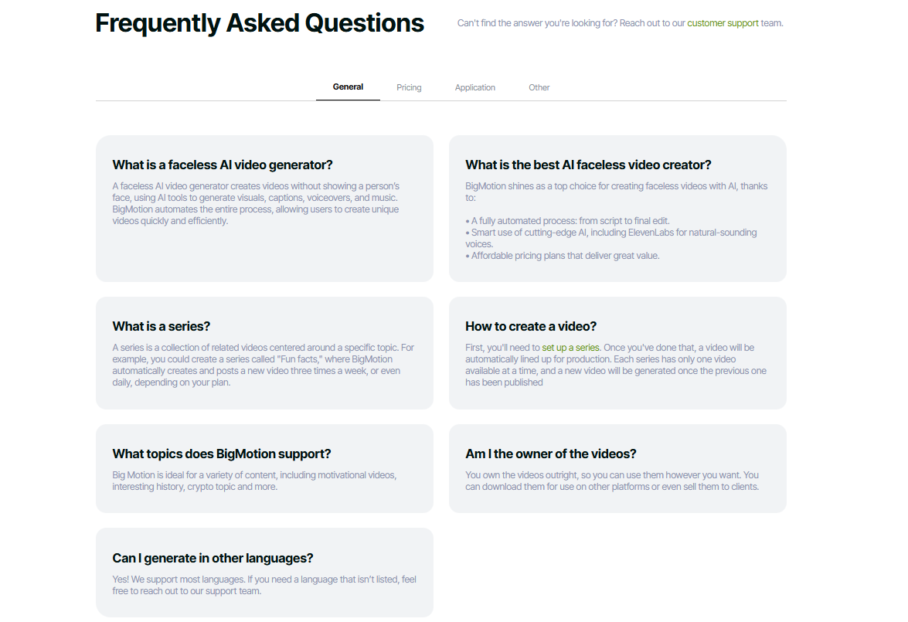
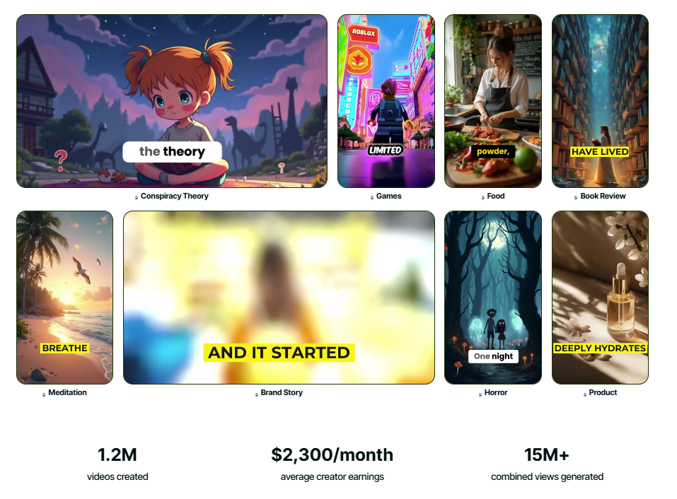
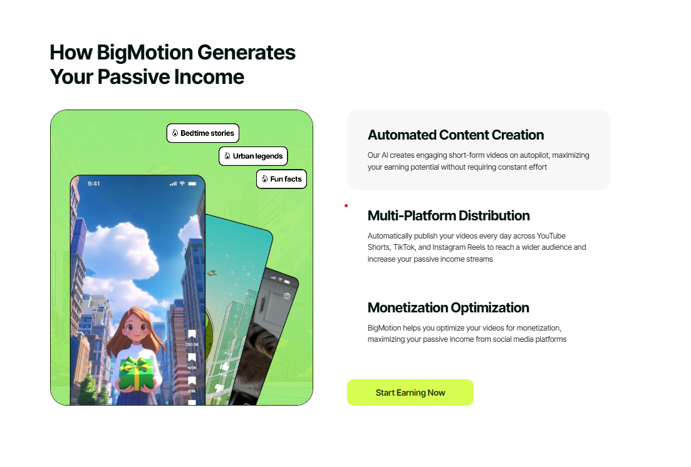
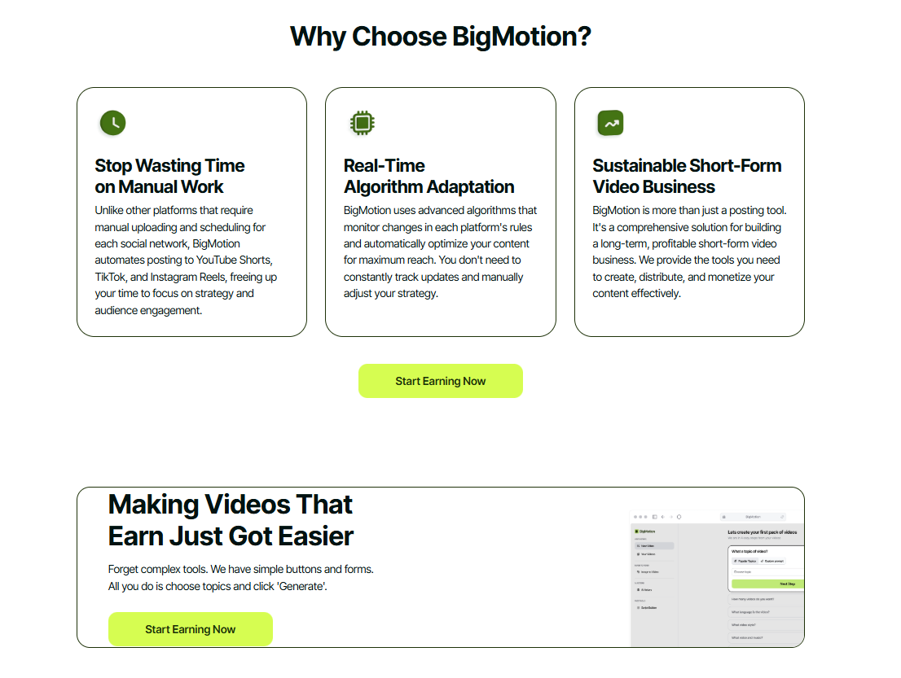
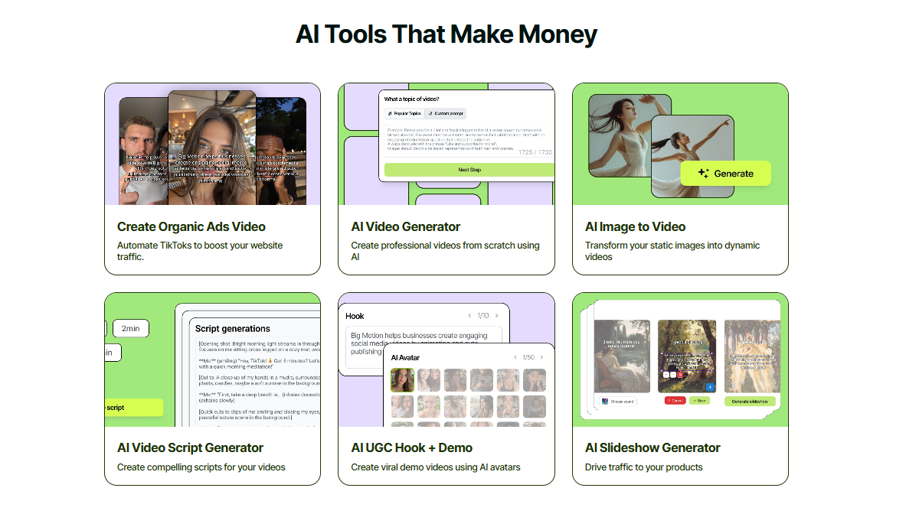

lets create a landing page. I will give you screenshots of each component and i need u to build that. I need u to build this landing page in next js and tailwind.

So a brief description. This landing page is about an ai based short form video generator. There will be some places in the screenshot where u will see videos. I need u to use any placeholder for now.

Strictly stick to our color pallete:

Primary Green (primary color) #C8FF4D

Primary Green Hover#D5FF6A

Primary Green Pressed#B8F443

Accent Green#A4F35C

Dark Background#0F1115

Surface 1#16181D

Surface 2#1C1F26

Surface 3#23262E

Primary Text#F2F2F2

Secondary Text#B5B8C2

Muted Text#7A7F89

     
